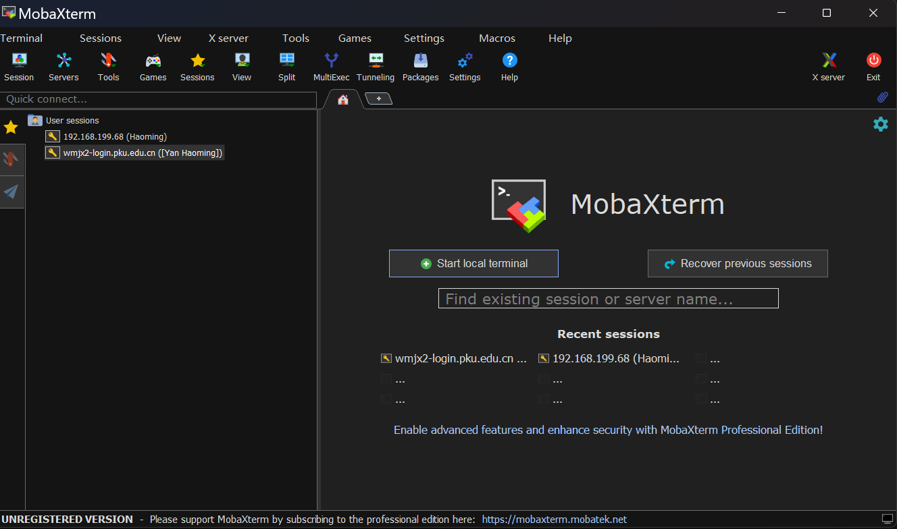
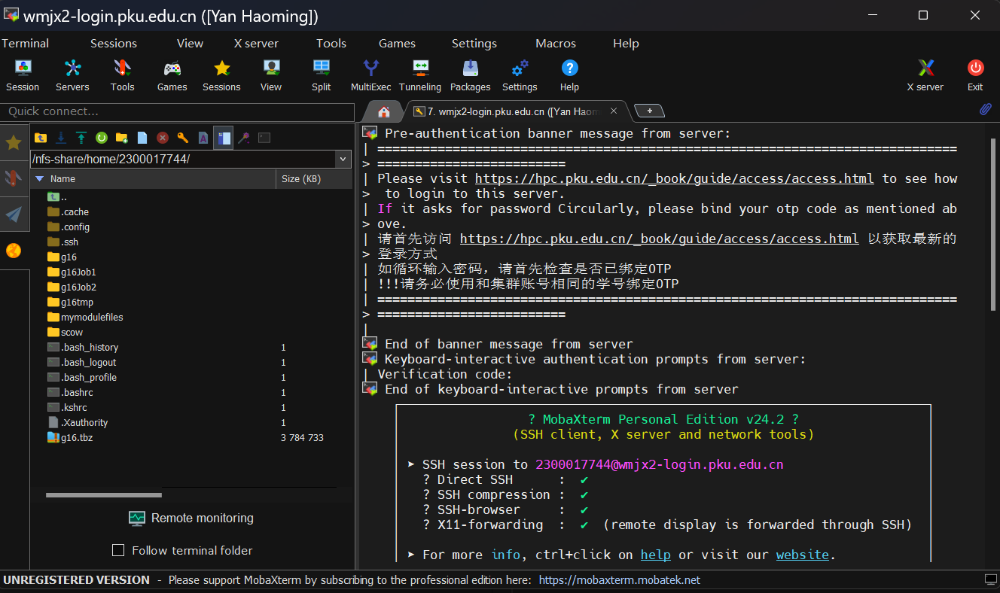
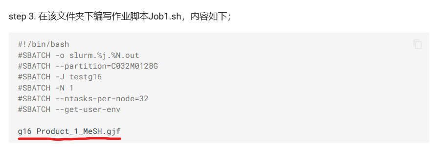

# Introduction

**Gaussian** is a powerful software for computational chemistry and its Linux version has better performance than Windows version.

**GaussView** is for visualization of input and output files of Gaussian.

Usually, a task of calculating in Gaussian takes several hours to days so it's necessary to be performed on supercompter platform. So you can refer to the folder [Supercomputer Platform](../Supercomputer%20Platform/) for more details.

# Step By Step Procedure
0. Keep in Campus Internet(Use VPN outside campus)
1. Open MobaXterm
 
2. Log in to wmjx2 server

3. Follow the [description](https://hpc.pku.edu.cn/ug/soft/gaussian/). But pay attention to the severe mistake in the document .
* The mistake in the document.

We should add '<' between 'g16' and 'xxx.gjf' like the following example: ```g16 < Fluorescein_Opt.gjf```. Or there will be a confusing error.